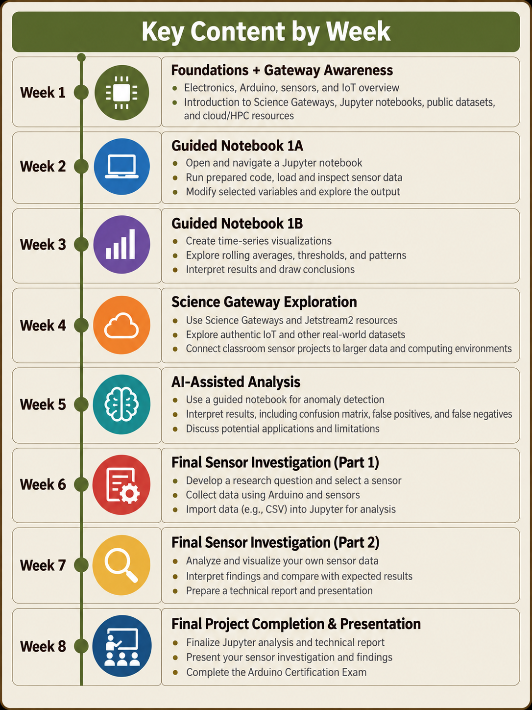
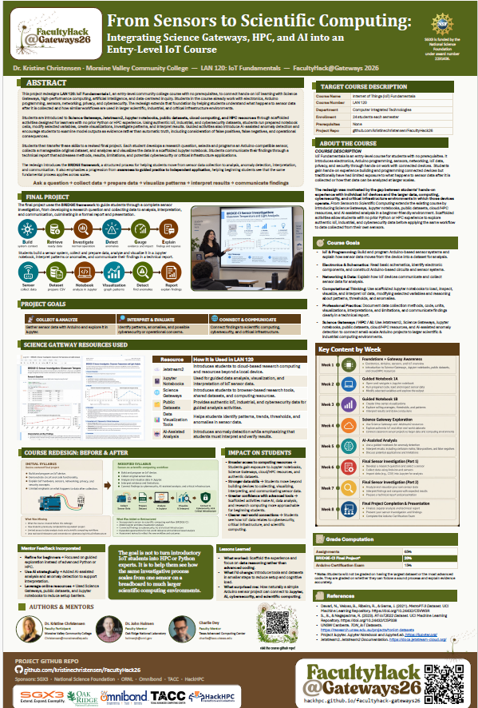

# 🌱 From Sensors to Scientific Computing
### Integrating Science Gateways, HPC, and AI into an Entry-Level IoT Course

**FacultyHack@Gateways 2026 · LAN 120: IoT Fundamentals I · Moraine Valley Community College**

> **Project idea:** Help beginning IoT students see how the same process they use with one sensor on a breadboard can scale to authentic datasets, Jupyter notebooks, AI-assisted analysis, and larger scientific computing environments.

<p align="center">
  <a href="https://kristinechristensen.github.io/FacultyHack26/"><strong>🌐 View the Project Website</strong></a>
  &nbsp;·&nbsp;
  <a href="./project-materials/"><strong>📁 Browse Project Materials</strong></a>
  &nbsp;·&nbsp;
  <a href="./project-materials/poster/ChristensenFacultyHack_Gateways26.pdf"><strong>🖼️ View the Poster</strong></a>
  &nbsp;·&nbsp;
  <a href="./about.html"><strong>👤 About Kristine</strong></a>
</p>

---

## 🔌 Project Overview

This project redesigns **LAN 120: IoT Fundamentals I**, an entry-level course with no prerequisites. Students already learn electronics, Arduino programming, sensors, networking, IoT data, privacy, and security through hands-on work with connected devices.

The FacultyHack redesign adds an approachable pathway into **Science Gateways, Jetstream2, Jupyter notebooks, public datasets, cloud/HPC concepts, visualization, and AI-assisted analysis**. Students first work with authentic datasets in scaffolded notebook activities and then transfer the same process to a final investigation using data collected from their own Arduino-compatible sensor.

### The transferable workflow

**Ask a question → collect data → prepare data → visualize patterns → interpret results → communicate findings**

---

## 🌉 BRIDGE-CI Framework

| Step | Student Action |
|---|---|
| **B — Build** | Establish the system context |
| **R — Retrieve & Ready** | Obtain and prepare the data |
| **I — Investigate** | Examine normal operation and patterns |
| **D — Detect** | Identify anomalies with guided / AI-assisted methods |
| **G — Gauge** | Consider the evidence and potential impact |
| **E — Explain** | Communicate findings, limitations, and response |

The emphasis is not advanced programming. The emphasis is helping beginning students reason through a data-centered IoT investigation with support from structured notebooks and authentic examples.

---

## 🎯 Course Goals

- ⚡ **Electronics & Schematics:** Read basic schematics, identify components, and construct Arduino-based circuits and sensor systems.
- 🔧 **IoT Hardware & Programming:** Build and program IoT devices using Arduino, sensors, and embedded-system concepts.
- 📡 **Networking & Data:** Explain how IoT devices communicate and collect sensor data for analysis.
- 📊 **Data Analysis:** Use scaffolded Jupyter notebooks to load, visualize, and interpret sensor data.
- ☁️ **Science Gateways / HPC / AI:** Use Jetstream2, public datasets, cloud/HPC resources, and AI-assisted tools to explore how IoT data can be analyzed beyond a single device.

---

## 📚 Learning Progression

| Stage | What Students Do |
|---|---|
| **1 · Awareness** | Meet Science Gateways, Jupyter, public datasets, cloud/HPC concepts, visualization, and AI-assisted analysis |
| **2 · Guided Practice** | Run prepared notebook cells, change selected variables, create graphs, and interpret results |
| **3 · Transfer** | Collect original sensor data, analyze a CSV in Jupyter, and communicate findings |

---

## 📓 Notebook Sequence

<table>
<tr>
<td width="33%" valign="top">
<strong>1 · Sensor Data Exploration</strong><br><br>
Students load and inspect authentic sensor data, create time-series visualizations, and describe patterns.<br><br>
<a href="./project-materials/notebook-previews/01_sensor_data_exploration_preview.png">View preview →</a>
</td>
<td width="33%" valign="top">
<strong>2 · IoT Anomaly Detection</strong><br><br>
Students use guided AI-assisted analysis and interpret a confusion matrix, including false positives and false negatives.<br><br>
<a href="./project-materials/notebook-previews/02_iot_anomaly_detection_preview.png">View preview →</a>
</td>
<td width="33%" valign="top">
<strong>3 · Arduino Sensor Investigation</strong><br><br>
Students transfer the workflow to a small dataset they collect themselves and use visual evidence to answer a research question.<br><br>
<a href="./project-materials/notebook-previews/03_arduino_sensor_investigation_preview.png">View preview →</a>
</td>
</tr>
</table>

> **Note:** The current repository package includes visual notebook previews. Executable `.ipynb` files can be added to the same materials structure when finalized.

---

## 🗂️ Datasets

| Dataset | Source | Course Use |
|---|---|---|
| **MetroPT-3** | [UCI Machine Learning Repository](https://archive.ics.uci.edu/dataset/791/metropt%203%20dataset) | Jupyter basics, industrial sensor visualization, patterns, thresholds |
| **RT-IoT2022** | [UCI Machine Learning Repository](https://archive.ics.uci.edu/dataset/942/rt-iot2022) | AI-assisted classification, anomaly interpretation, confusion matrices |
| **TON_IoT** | [UNSW Canberra](https://research.unsw.edu.au/projects/toniot-datasets) | Optional extension into larger IoT/IIoT, IT/OT, and system data |
| **Student Sensor Data** | LAN 120 students | Final project using a small original CSV dataset |

---

## 🔧 Final Sensor Investigation

Students:

1. Develop a research question.
2. Select an Arduino-compatible sensor.
3. Build the circuit and program the Arduino.
4. Determine a data-collection method and sampling interval.
5. Collect and export a manageable dataset.
6. Load the CSV into a scaffolded Jupyter notebook.
7. Create visualizations and interpret the evidence.
8. Explain limitations and next steps.
9. Communicate the investigation in a technical report and presentation.

**[Open the Final Project PDF](./project-materials/final-project/LAN_120_Final_Project.pdf)**

### Grade computation

| Grade Component | Weight |
|---|---:|
| Assignments | 65% |
| **BRIDGE-CI Final Project** | **20%** |
| Arduino Certification Exam | 15% |
| **Total** | **100%** |

---

## 🗓️ Key Content by Week

[](./assets/images/key-content-by-week-timeline.png)

---

## 📁 Repository Structure

```text
FacultyHack26/
├── index.html                                  # Main GitHub Pages website
├── about.html                                  # About Kristine + résumé link
├── README.md                                   # Repository overview
├── PACKAGE_CONTENTS.md                         # Complete package inventory
├── assets/
│   ├── styles.css                              # Shared website styling
│   ├── Kristine-Christensen-Resume-2026.pdf
│   └── images/
│       ├── kristine-christensen.jpg
│       ├── john-holmen.jpg
│       ├── charlie-dey.jpg
│       └── key-content-by-week-timeline.png
└── project-materials/
    ├── index.html                              # Web-based materials index
    ├── README.md                               # Markdown materials index
    ├── assets/
    │   ├── 2026ChristensenKristine.pdf
    │   ├── kristine-christensen.jpg
    │   ├── JohnHolmen.jpg
    │   └── CharlieDey.jpg
    ├── syllabus/
    │   ├── LAN_120_Initial_Syllabus.pdf
    │   └── LAN_120_Revised_Syllabus.pdf
    ├── final-project/
    │   └── LAN_120_Final_Project.pdf
    ├── datasets/
    │   └── student_dataset_guide.md
    ├── notebook-previews/
    │   ├── 01_sensor_data_exploration_preview.png
    │   ├── 02_iot_anomaly_detection_preview.png
    │   └── 03_arduino_sensor_investigation_preview.png
    ├── poster/
    │   ├── ChristensenFacultyHack_Gateways26.pdf
    │   └── final_poster_preview.png
    └── resources/
        ├── DATASET_GUIDE.md
        ├── STUDENT_DATASET_GUIDE.md
        └── working_README.md
```

---

## 📦 Project Materials

| Area | Files |
|---|---|
| **Syllabi** | [Initial syllabus](./project-materials/syllabus/LAN_120_Initial_Syllabus.pdf) · [Revised syllabus](./project-materials/syllabus/LAN_120_Revised_Syllabus.pdf) |
| **Final Project** | [LAN 120 Final Project](./project-materials/final-project/LAN_120_Final_Project.pdf) |
| **Dataset Guides** | [Student dataset guide](./project-materials/datasets/student_dataset_guide.md) · [Dataset guide](./project-materials/resources/DATASET_GUIDE.md) · [Expanded student guide](./project-materials/resources/STUDENT_DATASET_GUIDE.md) |
| **Notebook Previews** | [Sensor exploration](./project-materials/notebook-previews/01_sensor_data_exploration_preview.png) · [Anomaly detection](./project-materials/notebook-previews/02_iot_anomaly_detection_preview.png) · [Arduino investigation](./project-materials/notebook-previews/03_arduino_sensor_investigation_preview.png) |
| **Poster** | [Poster PDF](./project-materials/poster/ChristensenFacultyHack_Gateways26.pdf) · [Poster preview](./project-materials/poster/final_poster_preview.png) |
| **Faculty** | [About Kristine](./about.html) · [Résumé PDF](./assets/Kristine-Christensen-Resume-2026.pdf) |
| **All Materials** | [Open the project-materials index](./project-materials/) |

---

## 👥 FacultyHack Team

**Dr. Kristine Christensen**  
Faculty Participant · Moraine Valley Community College  
[About Kristine](./about.html) · [Résumé](./assets/Kristine-Christensen-Resume-2026.pdf)

**Dr. John Holmen**  
Faculty Mentor · Oak Ridge National Laboratory

**Charlie Dey**  
Technical Collaborator · Texas Advanced Computing Center

---

## 🖼️ Conference Poster

[](./project-materials/poster/ChristensenFacultyHack_Gateways26.pdf)

**[Open the full poster PDF →](./project-materials/poster/ChristensenFacultyHack_Gateways26.pdf)**

---

## 🌐 Publishing with GitHub Pages

This repository is **website-first**. The root `index.html` is the project landing page.

1. Upload the repository contents to the `main` branch.
2. Open **Settings → Pages** in GitHub.
3. Under **Build and deployment**, select **Deploy from a branch**.
4. Choose **main** and **/(root)**.
5. Save.

The site should then be available at:

**https://kristinechristensen.github.io/FacultyHack26/**

---

## FacultyHack@Gateways 2026

This project was developed for **FacultyHack@Gateways 2026**, a curriculum-development experience focused on bringing advanced computing, AI, and Science Gateway resources into teaching and learning.

**Official FacultyHack@Gateways 2026 site:**  
https://hackhpc.github.io/facultyhack-gateways26
